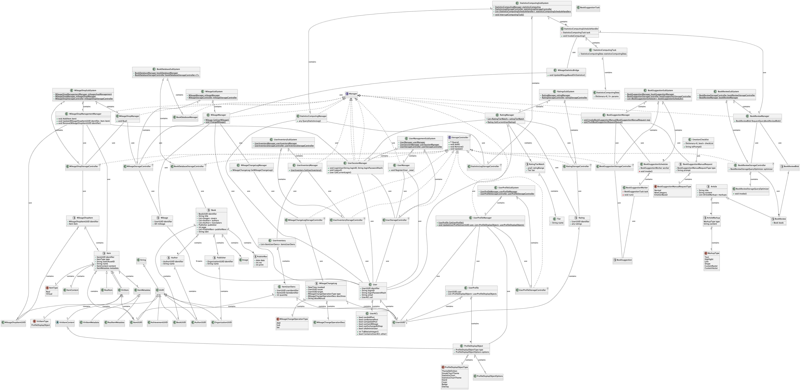

# 소프트웨어공학론 소프트웨어 정의

  

소프트웨어공학론(전남대, 소프트웨어공학과, 김미수, 2024-1) 소프트웨어 정의 팀 프로젝트

## Participants

* 모아림([@ariimo](https://github.com/ariimo))
* 유정빈([@xxbeann](https://github.com/xxbeann))
* 이창효
* 박종현([@ShapeLayer](https://github.com/ShapeLayer))
* 박지환([@latencyspace](https://github.com/latencyspace))

## Requirements

* PlantUML

For installing PlantUML, see [Quick Start Guide](https://plantuml.com/en/starting). If you are using mac, see [Homebrew Formulae](https://formulae.brew.sh/formula/plantuml).
